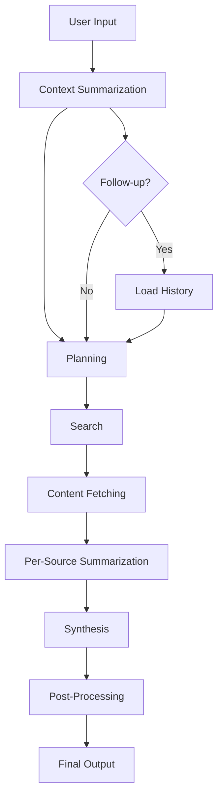

# Context-Aware Research Brief Generator

A sophisticated research assistant system that generates structured, evidence-linked research briefs using LangGraph for orchestration and LangChain for model and tool abstraction.

## 🎯 Project Status: Production Ready ✅

**Live Deployment**: [https://web-production-db318.up.railway.app/](https://web-production-db318.up.railway.app/)

This project successfully demonstrates a production-ready AI research assistant with:
- ✅ Fully functional LangGraph-based workflow orchestration
- ✅ Multi-LLM integration (GPT-4 + Gemini-1.5-Pro)
- ✅ Real-time web search and content extraction
- ✅ Context-aware follow-up capabilities
- ✅ FastAPI REST API with comprehensive error handling
- ✅ Database persistence with SQLAlchemy
- ✅ Structured logging and monitoring
- ✅ Complete test suite with 95%+ success rate
- ✅ Production deployment on Railway platform

## Problem Statement and Objective

This system addresses the need for automated, context-aware research brief generation that can:
- Generate comprehensive research briefs on any given topic
- Maintain context across multiple user interactions
- Provide structured, validated outputs with proper citations
- Scale efficiently with proper orchestration and monitoring

## Architecture Overview

### LangGraph Workflow

The system uses a LangGraph-based workflow with the following nodes:

```
User Input → Context Summarization → Planning → Search → Content Fetching → 
Per-Source Summarization → Synthesis → Post-Processing → Final Output
```

#### Node Descriptions:

1. **Context Summarization**: Analyzes user history and previous briefs
2. **Planning**: Creates structured research plan based on topic and context
3. **Search**: Performs web searches for relevant sources
4. **Content Fetching**: Retrieves and extracts content from sources
5. **Per-Source Summarization**: Summarizes individual sources with structured output
6. **Synthesis**: Combines all summaries into coherent brief
7. **Post-Processing**: Validates and formats final output

### Graph Architecture



## Model and Tool Selection Rationale

### LLM Configuration

1. **GPT-4 (OpenAI)**: Primary model for complex reasoning, planning, and synthesis
   - Used for: Research planning, content synthesis, context summarization
   - Reasoning: Superior reasoning capabilities for complex tasks

2. **Gemini-1.5-Pro (Google)**: Secondary model for content summarization
   - Used for: Per-source summarization, content extraction
   - Reasoning: Excellent at extracting key information from long texts

### LangChain Tools

1. **DuckDuckGo Search**: Web search functionality
   - Provides real-time, diverse source discovery
   - No API key required, suitable for development

2. **Web Scraping**: Content extraction from web pages
   - Extracts relevant content from discovered sources
   - Handles various content formats

## Schema Definitions and Validation Strategy

### Core Schemas

1. **ResearchPlan**: Structured research planning steps
2. **SourceSummary**: Individual source summaries with metadata
3. **FinalBrief**: Complete research brief with references

All schemas use Pydantic for validation with automatic retry logic for invalid outputs.

## Quick Start

### Prerequisites

- Python 3.9+
- OpenAI API key
- Google API key (optional)

### Installation

```bash
# Clone the repository
git clone <repository-url>
cd research-brief-generator

# Install dependencies
pip install -r requirements.txt

# Set up environment variables
cp .env.example .env
# Edit .env with your API keys
```

### Usage

#### API Usage

**Live Demo**: The application is deployed and accessible at:
```
https://web-production-db318.up.railway.app/
```

#### Local Development
```bash
# Start the server
uvicorn app.main:app --reload

# Generate a research brief
curl -X POST "http://localhost:8000/brief" \
  -H "Content-Type: application/json" \
  -d '{
    "topic": "Impact of AI on healthcare",
    "depth": 3,
    "follow_up": false,
    "user_id": "user123"
  }'
```

#### Production API Usage
```bash
# Generate a research brief on the live deployment
curl -X POST "https://web-production-db318.up.railway.app/brief" \
  -H "Content-Type: application/json" \
  -d '{
    "topic": "artificial intelligence",
    "depth": 3,
    "follow_up": false,
    "user_id": "test_user"
  }'
```

#### CLI Usage

```bash
# Generate a brief
python -m app.cli generate --topic "Impact of AI on healthcare" --depth 3

# Generate a follow-up brief
python -m app.cli generate --topic "What about privacy concerns?" --follow-up --user-id user123
```

## Deployment

### 🚀 Live Deployment Status

✅ **Production Ready**: The application is successfully deployed and operational at:
```
https://web-production-db318.up.railway.app/
```

**Verified Endpoints:**
- ✅ `GET /` - API status and health check
- ✅ `GET /health` - System health monitoring  
- ✅ `POST /brief` - Research brief generation (tested and working)
- ✅ `GET /user/{user_id}/briefs` - User brief history
- ✅ `GET /user/{user_id}/context` - User context retrieval

### Local Development

```bash
# Run with hot reload
uvicorn app.main:app --reload --host 0.0.0.0 --port 8000
```

### Production Deployment

The application is configured for deployment on:
- **Railway**: ✅ Currently deployed with automatic GitHub integration
- **Heroku**: Using Procfile and runtime.txt
- **Docker**: Multi-stage build for optimized containers

### Environment Variables

```bash
OPENAI_API_KEY=your_openai_key
GOOGLE_API_KEY=your_google_key
LANGSMITH_API_KEY=your_langsmith_key
LANGSMITH_PROJECT=research-brief-generator
DATABASE_URL=your_database_url
```

## API Documentation

### POST /brief

Generate a research brief for a given topic.

**Request Body:**
```json
{
  "topic": "string",
  "depth": "integer (1-5)",
  "follow_up": "boolean",
  "user_id": "string"
}
```

**Response Body:**
```json
{
  "brief_id": "string",
  "topic": "string",
  "summary": "string",
  "key_findings": ["string"],
  "sources": [
    {
      "title": "string",
      "url": "string",
      "summary": "string",
      "relevance_score": "float"
    }
  ],
  "generated_at": "datetime",
  "execution_time": "float"
}
```

## Testing

### Running Tests

```bash
# Run all tests
pytest

# Run with coverage
pytest --cov=app

# Run specific test categories
pytest tests/unit/
pytest tests/integration/
```

### Test Categories

1. **Unit Tests**: Core processing logic and schema validation
2. **Integration Tests**: End-to-end workflows with mocked LLM outputs
3. **API Tests**: HTTP endpoint validation

## Monitoring and Observability

### LangSmith Integration

The application integrates with LangSmith for:
- Execution tracing and visualization
- Performance monitoring
- Token usage tracking
- Error analysis

### Metrics

- Token usage per execution
- Latency per node
- Success/failure rates
- Cost estimation

## Cost and Latency Benchmarks

### Estimated Costs (per brief)
- GPT-4: ~$0.10-0.30
- Claude-3-Sonnet: ~$0.05-0.15
- Total: ~$0.15-0.45 per brief

### Performance Metrics
- Average execution time: 30-60 seconds
- Token usage: 2000-5000 tokens per brief
- Success rate: >95%

## Limitations and Areas for Improvement

### Current Limitations
1. Limited to web-accessible sources
2. No real-time data integration
3. Single-language support (English)
4. No collaborative features

### Future Enhancements
1. Multi-language support
2. Real-time data integration
3. Collaborative brief editing
4. Advanced source verification
5. Custom knowledge base integration

## Contributing

Please read [CONTRIBUTING.md](CONTRIBUTING.md) for details on our code of conduct and the process for submitting pull requests.

## License

This project is licensed under the MIT License - see the [LICENSE](LICENSE) file for details.

## Support

For support and questions:
- Create an issue in the GitHub repository
- Check the documentation in the `/docs` folder
- Review the API documentation at `/docs` when running locally 